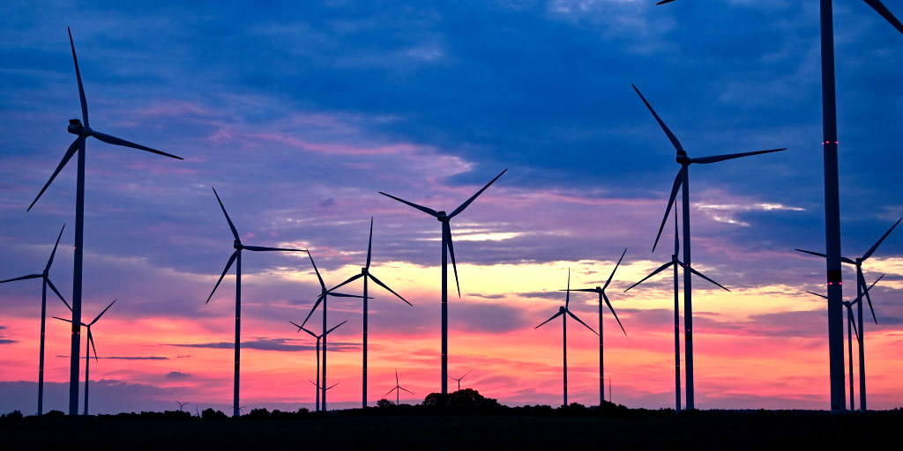

This course reader was developed by [Professor Colin Ophus](https://colab.stanford.edu/) and [Peiwen Ren](https://pwren.me/) for [MatSci 144](https://explorecourses.stanford.edu/search?q=MATSCI144) at [Stanford University](https://www.stanford.edu/).
It is based on Emma Kaeli’s course at Stanford University, adapted from Professor William C. Chueh’s course reader. Additional contributing authors include Yiyang Li, Petr Johanes, and Norman Jin.

## Table of Contents

TODO - add ToC

## Licence

This reader was developed under the [CC BY 4.0 license](https://creativecommons.org/licenses/by/4.0/).

