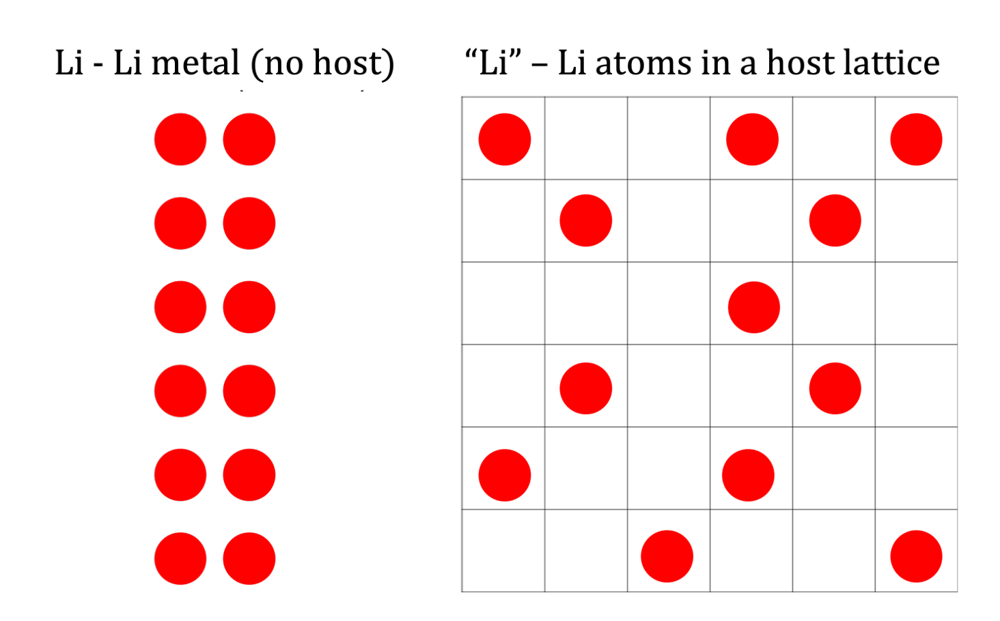

In the negative electrode, Li is plated onto the lithium metal or dissolved into the electrolyte in the form of $\text{Li}^+$. The only contribution to the Gibbs free energy we consider is that of pure Li metal:

$$
\label{eq:mu_li_metal}
\mu_{\text{Li}} = \mu^0_{\text{Li metal}}
$$

where $N$ is the number of Li atoms. When there is no Li present, $G_{\text{Li}} = 0$. There is also no configurational entropy associated with plating, since Li metal is a pure compound with no vacancies. Thus, we write the chemical potential as

$$
\mu_{\text{Li}} = \mu^0_{\text{Li metal}}
$$

<!--  -->

<!-- 


Li in metallic form. The atoms are packed tightly with no alternative configurations, so there is no configurational entropy.
 -->

```{figure} ../images/batteries/li_metal_vs_host_lattice.png
:label: fig:li_metal_no_config_entropy
:align: center
:width: 350px

Li in metallic form is closely packed with essentially no alternative configurations, so plating Li metal does not introduce a configurational entropy term.
```

[](#fig:li_metal_no_config_entropy) shows Li in metallic form. Because the negative electrode is treated as a pure phase with no vacancies in this model, there is no configurational entropy contribution associated with Li plating, and the chemical potential is simply $\mu_{\text{Li}}=\mu^0_{\text{Li metal}}$.
